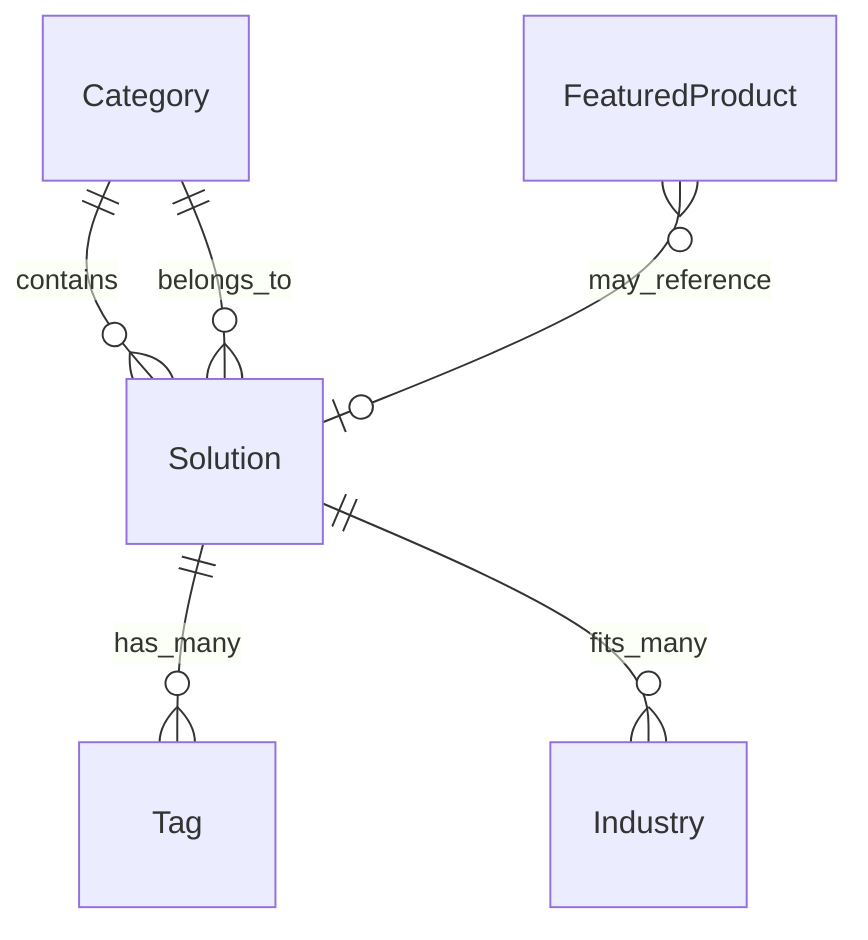

# Solutions System Architecture

## Overview

The T4I Solutions System is a comprehensive, data-driven architecture designed to support a scalable solutions marketplace with advanced SEO optimization, analytics tracking, and extensible content management.

## Design Principles

### 1. Single Source of Truth
All solution and category data is centralized in `/content/solutions.ts`, ensuring consistency across all UI components and preventing data duplication.

### 2. SEO-First Architecture
Every data structure includes comprehensive SEO metadata, structured data, and programmatic optimization for search engines and social media platforms.

### 3. Analytics-Driven Design
Built-in analytics tracking for all user interactions, with support for multiple analytics providers and conversion attribution.

### 4. Type-Safe Development
Full TypeScript coverage with comprehensive type definitions for all data structures, component props, and API responses.

### 5. Extensible by Design
Architecture supports easy addition of new solutions, categories, and future features like individual solution detail pages.

## File Structure

```
/content
  └── solutions.ts                 # Main data source with all solutions and categories

/types  
  └── solutions.ts                 # TypeScript type definitions

/lib/solutions
  ├── index.ts                     # Main exports and utilities
  ├── utils.ts                     # Data manipulation and filtering utilities
  ├── seo.ts                       # SEO optimization utilities
  └── analytics.ts                 # Analytics tracking and event management

/components/solutions (future)
  ├── SolutionsMegaMenu.tsx        # Navigation mega-menu component
  ├── SolutionsTileGrid.tsx        # Grid layout for category tiles
  ├── CategoryHero.tsx             # Hero section for category pages
  ├── SolutionCard.tsx             # Individual solution cards
  ├── SolutionFilters.tsx          # Filtering interface
  └── FeaturedProducts.tsx         # Featured products sidebar

/app/solutions (future)
  ├── page.tsx                     # Solutions landing page
  ├── [category]/page.tsx          # Category detail pages
  └── [category]/[solution]/page.tsx # Individual solution pages
```

## Data Model

### Core Entities

#### Solution
Individual AI solutions with comprehensive metadata:
- **Identity**: title, slug, category
- **Content**: summary, description, tags  
- **Flags**: featured, popular, new, enterprise, priority
- **Metrics**: implementation time, ROI timeline, complexity, industry fit
- **SEO**: complete metadata with structured data
- **Analytics**: tracking configuration
- **Extensibility**: features, benefits, pricing, content sections

#### Category  
Solution categories with display and SEO configuration:
- **Identity**: title, slug, icon, color
- **Content**: tagline, description
- **Solutions**: array of solutions in this category
- **Display**: grid layout, sort order, featured count
- **SEO**: metadata and structured data
- **Analytics**: tracking configuration

#### Featured Products
Special products highlighted across the site:
- **Identity**: title, slug, icon
- **Content**: description/blurb
- **Links**: href and analytics config

### Data Relationships



## Key Features

### 1. Mega-Menu Navigation
- **Hover-activated** mega-menu with 2x3 category grid
- **Featured solutions** displayed on category hover
- **Keyboard navigation** support with arrow keys and escape
- **Mobile-responsive** with accordion fallback

### 2. Homepage Integration
- **Expertise section** with 6 category tiles
- **Configurable layouts**: 2x3, 3x2, or 1x6 grid options
- **Responsive design** from mobile to desktop
- **Click tracking** for conversion attribution

### 3. Solutions Landing Page
- **Hero section** with configurable content
- **Category cards** with enhanced descriptions
- **SEO optimized** with comprehensive meta tags
- **Structured data** for search engine understanding

### 4. Category Detail Pages  
- **Category hero** with value proposition
- **Solution grid** with filtering options
- **Featured products** sidebar
- **Analytics tracking** for all interactions
- **Breadcrumb navigation** with structured data

### 5. Future Solution Detail Pages
Architecture ready for individual solution pages with:
- **Detailed content sections** (features, benefits, process, FAQ)
- **Rich media support** (images, videos, diagrams)
- **Lead capture forms** integrated with CRM
- **Related solutions** recommendations
- **Social sharing** with optimized meta tags

### 6. Advanced Filtering & Search
- **Multi-criteria filtering**: tags, complexity, industry, category
- **Fuzzy search** with scoring and highlighting
- **Real-time results** with debounced input
- **Analytics tracking** for search behavior

### 7. SEO Optimization
- **Programmatic meta tags** for all pages
- **Structured data** (JSON-LD) for rich snippets
- **Canonical URLs** to prevent duplicate content
- **Sitemap generation** for search engine discovery
- **Open Graph** and Twitter Card optimization

### 8. Analytics Integration
- **Multi-provider support**: Google Analytics, Facebook Pixel, LinkedIn
- **Custom event tracking** for all user interactions
- **Conversion attribution** with user journey tracking
- **Performance monitoring** with Core Web Vitals
- **A/B testing** support with experiment tracking

## Usage Examples

### Basic Data Access

```typescript
import { 
  getAllCategories, 
  findSolution, 
  getFeaturedSolutions 
} from '@/lib/solutions';

// Get all categories sorted by display order
const categories = getAllCategories();

// Find specific solution
const result = findSolution('customer-self-service', 'website-chatbot');
if (result) {
  const { solution, category } = result;
}

// Get featured solutions across all categories
const featured = getFeaturedSolutions(4);
```

### SEO Implementation

```typescript
import { generateCategoryMeta, generateMetaTags } from '@/lib/solutions';

// Generate meta tags for category page
const metadata = generateCategoryMeta('customer-self-service');
const metaTagsHTML = generateMetaTags(metadata);

// Use in Next.js page
export async function generateMetadata({ params }) {
  return generateCategoryMeta(params.category);
}
```

### Analytics Tracking

```typescript
import { trackSolutionInteraction, trackCategoryInteraction } from '@/lib/solutions';

// Track solution card click
const handleSolutionClick = (solution, category) => {
  trackSolutionInteraction(solution, category, 'card_click', {
    source: 'category_page',
    position: 1,
    variant: 'default'
  });
};

// Track category tile click
const handleCategoryClick = (category) => {
  trackCategoryInteraction(category, 'tile_click', {
    source: 'home_page',
    position: 2
  });
};
```

### Search Implementation

```typescript
import { searchSolutions, filterSolutions } from '@/lib/solutions';

// Fuzzy search with scoring
const searchResults = searchSolutions('chatbot automation', 5);

// Advanced filtering
const filteredResults = filterSolutions({
  selectedTags: ['Chat', 'Automation'],
  selectedComplexity: ['low', 'medium'],
  selectedIndustries: ['retail', 'finance'],
  selectedCategories: [],
  searchQuery: '',
  sortBy: 'popularity',
  sortDirection: 'desc'
});
```

## Performance Considerations

### 1. Data Loading
- **Static generation** for all solutions data at build time
- **Incremental regeneration** for content updates
- **Client-side caching** for search and filter results
- **Lazy loading** for non-critical components

### 2. Bundle Optimization
- **Tree shaking** to include only used solutions utilities  
- **Code splitting** by page type (landing, category, solution)
- **Dynamic imports** for heavy components
- **Image optimization** with Next.js Image component

### 3. SEO Performance
- **Server-side rendering** for all solutions pages
- **Structured data** generated at build time
- **Preload critical resources** (fonts, above-fold images)
- **Optimized meta tags** with proper length limits

### 4. Analytics Performance
- **Event batching** to reduce network requests
- **Local storage** for user journey tracking
- **Debounced tracking** for rapid interactions
- **Error handling** to prevent analytics failures from breaking UX

## Security Considerations

### 1. Data Validation
- **TypeScript interfaces** enforce data structure integrity
- **Runtime validation** for user inputs and form submissions
- **Slug sanitization** to prevent injection attacks
- **Analytics data filtering** to remove sensitive information

### 2. Content Security
- **Static data sources** reduce attack surface
- **No user-generated content** in core solutions data
- **Sanitized analytics events** before transmission
- **CORS policies** for analytics endpoints

## Maintenance & Updates

### 1. Adding New Solutions
1. Add solution object to appropriate category in `/content/solutions.ts`
2. Include all required fields (title, slug, summary, etc.)
3. Add SEO metadata and analytics configuration
4. Validate data integrity with `validateSolutionsData()`
5. Test in development environment
6. Deploy with incremental static regeneration

### 2. Adding New Categories
1. Create new category object in `/content/solutions.ts`
2. Configure display settings (icon, color, sort order)
3. Add SEO metadata and structured data
4. Update navigation components if needed
5. Test mega-menu and grid layouts
6. Update sitemap generation

### 3. Content Updates
- **Centralized editing** in solutions.ts file
- **Type checking** prevents breaking changes
- **Validation functions** ensure data integrity  
- **Git-based workflow** for version control
- **Automated testing** for data consistency

### 4. Performance Monitoring
- **Core Web Vitals** tracking for all solutions pages
- **Error monitoring** with detailed context
- **Analytics validation** to ensure tracking accuracy
- **A/B testing** for optimization opportunities

## Integration Points

### 1. CRM Integration
- **Lead capture** from solution CTAs
- **Attribution tracking** from first touch to conversion
- **Solution interest** tagging for lead scoring
- **Campaign tracking** for marketing attribution

### 2. Marketing Automation
- **Behavioral triggers** based on solution interests
- **Email segmentation** by solution categories
- **Retargeting pixels** for solutions visitors  
- **Content personalization** based on viewed solutions

### 3. Sales Enablement
- **Solution interest** data for sales conversations
- **Implementation timelines** for proposal generation
- **ROI projections** for business case development
- **Industry fit** data for lead qualification

## Future Enhancements

### Phase 2: Individual Solution Pages
- Detailed solution descriptions with rich content
- Customer case studies and testimonials  
- Interactive ROI calculators
- Integration with specific vendors/partners
- Advanced lead capture with progressive profiling

### Phase 3: Personalization Engine
- AI-powered solution recommendations
- Industry-specific content filtering
- Behavioral tracking for content optimization
- Dynamic pricing based on company size/industry

### Phase 4: Interactive Features
- Solution comparison tools
- Interactive demos and simulations  
- Virtual consultations and assessments
- Community features (reviews, discussions)

This architecture provides a solid foundation for the current requirements while maintaining flexibility for future expansion and optimization.